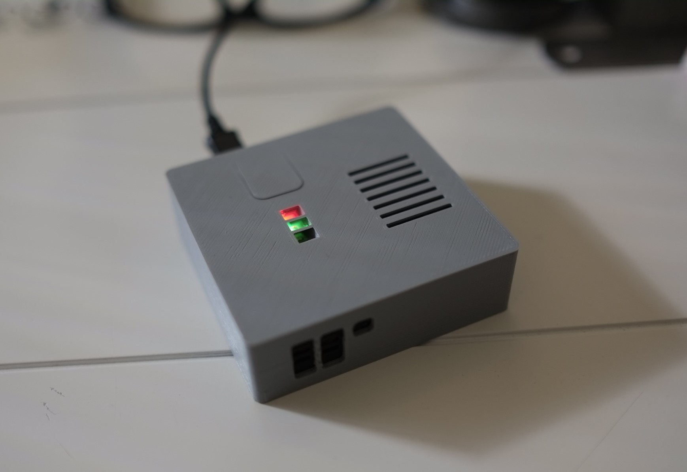

# NOTE
This project is no longer maintained. It was archieved 17 June 2020.

# talkiepi

talkiepi is a headless capable Mumble client written in Go, written for walkie talkie style communication on the Raspberry Pi.

This project is a fork of [Daniel Chote's](https://github.com/dchote) original [talkiepi project](https://github.com/dchote/talkiepi). It is different because it uses only off-the-shelf components and requires no soldering.

## Hardware

The hardware is based around a Raspberry Pi Zero and SeeedStudio ReSpeaker 2-mic Pi HAT. A full bill of materials with links to suppliers will be added shortly.

## 3D printable enclosure

The case was designed by Paul Van Gaans - [PrintVeryGood.com](https://printverygood.vangaans.com/). The geometry files are available in the stl directory.

## 3D wall mount adapter
A wall mount adapter was designed by [@schneekluth](https://github.com/schneekluth). Instructions and files can be found [here](stl/casemod_schneekluth).

## Installing talkiepi

I have put together an install guide [here](doc/README.md).

## License

MPL 2.0

## Author

- SeeedStudio ReSpeaker 2-Mic Pi HAT compatibility - [Ben Lewis](https://github.com/CustomMachines)
- talkiepi - [Daniel Chote](https://github.com/dchote)
- Barnard,Gumble Author - Tim Cooper (<tim.cooper@layeh.com>)

