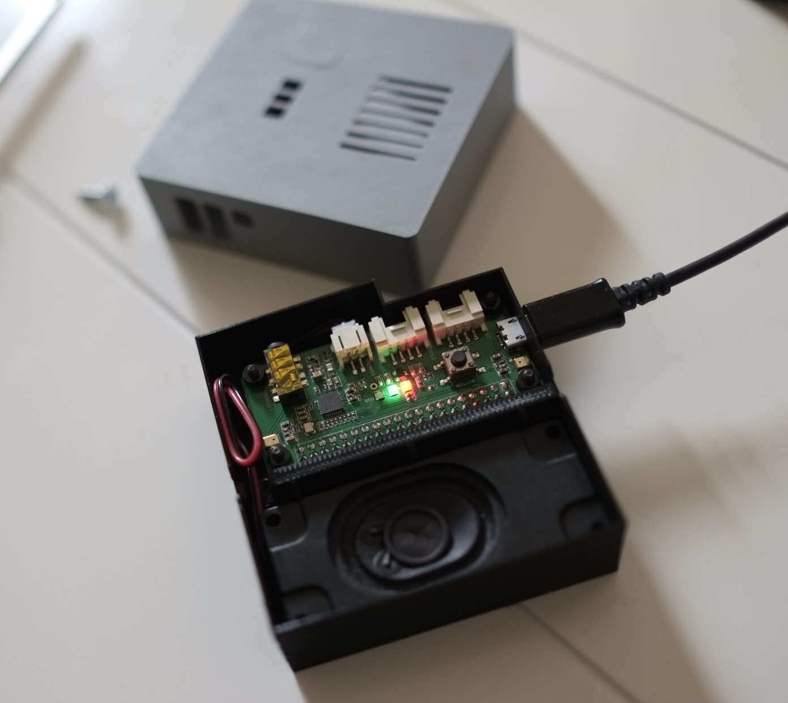

# TalkiePi Setup Guide

Here are the steps required to setup a TalkiePi with a Raspberry Pi Zero W and SeeedStudio ReSpeaker 2-Mic Pi HAT. These instructions assume you are using a Windows PC to configure the RPi.

By default, TalkiePi will run without any arguments, it will autogenerate a username and then connect to Daniel Chote's mumble server.
You can change this behavior by appending command line arguments of `-server YOUR_SERVER_ADDRESS`, `-username YOUR_USERNAME` to the ExecStart line in `/etc/systemd/system/mumble.service` once installed.

TalkiePi will also accept arguments for `-password`, `-insecure`, `-certificate` and `-channel`, all defined in `cmd/talkiepi/main.go`, if you run your own mumble server, these will be self-explanatory.

## Hardware Requirements
* (1) Raspberry Pi Zero W
* (1) [SeeedStudio ReSpeaker 2-Mic Pi HAT](http://wiki.seeedstudio.com/ReSpeaker_2_Mics_Pi_HAT/)
* (1) [Stereo speaker (3W, 8Ω) with JST connector](https://core-electronics.com.au/stereo-enclosed-speaker-3w-8.html)
* (1) MicroSD card, 16GB, class 10 with SD card adapter
* (1) Power adapter with micro USB cable
* (4) [M2.5 Brass Standoffs](https://core-electronics.com.au/brass-m2-5-standoffs-for-pi-hats-black-plated-pack-of-2.html)
* (4) M2.5 x 6 mm screws

## Install Operating System

Download the Stretch version of [Raspbian Lite](https://downloads.raspberrypi.org/raspbian_lite/images/raspbian_lite-2019-04-09/) - Talkiepi doesn't work with more recent versions.

Write the image to a miroSD card with [Etcher](https://etcher.io/). Note, after the write is complete Windows will complain that the microSD card needs to be formatted. This message can be ignored. It is just that Windows cannot read the Linux partitions, but Windows can read the **Boot** partition which is the only one we need access to. 

Create two files on the **Boot** partition of the microSD card:

~~~
wpa_supplicant.conf
ssh
~~~

Below is a template for the wpa_supplicant.conf file. Please edit these details to match one or more wireless networks you intend to use. You can define as many networks as you like, if using only one network please delete the second network definition. Also, the two-letter country code should match the country you are operating in.

Note, the file must be formatted with Unix style line end characters (i.e. LF not CR LF). [Notepad++](https://notepad-plus-plus.org/) is an example of a Windows based text editor that supports this.

~~~
ctrl_interface=DIR=/var/run/wpa_supplicant GROUP=netdev
update_config=1
country=AU

network={
    id_str="descriptive name for network 2"
    ssid="SSID2"
    psk="password2"
    key_mgmt=WPA-PSK
    priority=2
}

network={
    id_str="descriptive name for network 1"
    ssid="SSID1"
    psk="password1"
    key_mgmt=WPA-PSK
    priority=1
}
~~~

The ssh file should be empty.

Insert the microSD card into the RPi and apply power. The RPi will boot and attempt to connect one of the WiFi networks defined above with SSH enabled.

Use [Advanced Port Scanner](https://www.advanced-port-scanner.com/) or your router’s web interface to find the IP address of the RPi.

Use [PuTTY](http://www.putty.org/) to make an SSH connection to the RPi.

The default login credentials are:

~~~
raspberrypi login: pi
password: raspberry
~~~

Update repositories and upgrade software with:

~~~
$sudo apt update
$sudo apt upgrade
~~~

## Raspi-Config

Start the RPi configuration tool with this command:

~~~
$sudo raspi-config
~~~

Make the follow configuration changes:

1. Change User Password > Ok > YOUR_PASSWORD > YOUR_PASSWORD
1. Network Options > N1 Hostname > Ok > YOU_HOSTNAME > Ok
1. Localisation Options > I2 Change Timezone > YOUR_COUNTRY > YOUR_CITY
1. Localisation Options > I4 Change WiFi Country > YOUR_COUNTRY_CODE > Ok
1. Interfacing Options > P4 SPI > Yes > Ok
1. Advanced Options > A1 Expand Filesystem > Ok
1. Finish > Reboot? Yes

## Disable HDMI

To save power the HDMI output can be disabled at boot.

~~~
$sudo nano /etc/rc.local
~~~

Add the following lines above exit 0:

~~~
# Disable HDMI
/usr/bin/tvservice -o
~~~

## Git
Install Git with this command:

~~~
$sudo apt install git
~~~

## SeeedStudio ReSpeaker 2-Mic HAT
Install the latest version of seeed-voicecard:

~~~
git clone https://github.com/respeaker/seeed-voicecard.git
cd seeed-voicecard
sudo ./install.sh  --compat-kernel
~~~

If the install fails due to insufficient space in the boot folder, temporarily create some space by moving kernel7.img to the tmp folder.  No need to move it back because by the time the install has finished it magically re-appears.
~~~
sudo mv /boot/kernel7.img /tmp/
~~~

Disable pi's on board sound. While not essential but cleans things up when you list the sound devices with the "aplay -l" command.
~~~
sudo nano /etc/modprobe.d/blacklist-alsa.conf
~~~
In this blank file enter the following line:
~~~
blacklist snd_bcm2835
~~~

Edit the ALSA configuration:
~~~
$cp asound_2mic.conf ~/.asoundrc
$cd
$nano ~/.asoundrc
~~~

Set the bit rate to 16kHz and period size to at least 960 (which equates to a frame size of 60ms or 960/16) and then buffer size of four times period size or 3840.  Feel free to play around with these numbers but this worked best for me.

The edited file should look like this.
~~~
# The IPC key of dmix or dsnoop plugin must be unique
# If 555555 or 666666 is used by other processes, use another one

pcm.!default {
    type asym
    playback.pcm "playback"
    capture.pcm "capture"
}

pcm.playback {
    type plug
    slave.pcm "dmixed"
}

pcm.capture {
    type plug
    slave.pcm "array"
}

pcm.dmixed {
    type dmix
    slave {
        pcm "hw:seeed2micvoicec"
        period_size 960
        buffer_size 3840
        rate 16000
    }
    ipc_key 555555 
}

pcm.array {
    type dsnoop
    slave {
        pcm "hw:seeed2micvoicec"
        channels 2
        period_size 960
        buffer_size 3840
        rate 16000
    }
    ipc_key 666666
}
~~~

Save (CTRL-O) and exit (CTRL-X).

The following will help speed things up a bit when adjusting sample rates:

~~~
sudo apt-get install haveged
~~~

Reboot:

~~~
$sudo reboot
~~~

### Optional Audio Tests

Test the speaker and mic with:

~~~
$arecord -f cd | aplay
~~~

Test speakers with the following command (CTRL-C to quit).

~~~
$speaker-test
~~~

Test the microphone with:

~~~
$arecord test.wav
$aplay test.wav
$rm test.wav
~~~

Audio configuration is done with:

~~~
$alsamixer
~~~

## Install Prerequisites

Install prerequisites with:
~~~
$sudo apt install libopenal-dev libopus-dev
~~~

## Golang

Install latest Golang version:
~~~
wget https://dl.google.com/go/go1.15.2.linux-armv6l.tar.gz
sudo tar -C /usr/local -xzf go1.15.2.linux-armv6l.tar.gz
rm go1.15.2.linux-armv6l.tar.gz
~~~

You can check you Golang version with:
~~~
$go version
go version go1.15.2 linux/arm
~~~

Setup Golang with:

~~~
$cd
$mkdir ~/go
$cd go
$mkdir src
$mkdir bin
$cd
~~~

Edit the ~/.profile file with:
~~~
$nano ~/.profile
~~~

Add the following text to the end of the file:
~~~
export GOPATH=$HOME/go
export GOBIN=$HOME/go/bin
export PATH=$PATH:/usr/local/go/bin
~~~

Reload the configuration with:
~~~
$source ~/.profile
~~~

## Install TalkiePi

Install TalkiePi with:

~~~
$cd $GOPATH/src
$go get periph.io/x/periph/cmd/...
$go get github.com/dchote/gopus
$go get github.com/CustomMachines/talkiepi
$go build -o $GOPATH/bin/talkiepi $GOPATH/src/github.com/CustomMachines/talkiepi/cmd/talkiepi/main.go
~~~

The RPi Zero needs libopenal complied without ARM NEON support. These packages can be found in the [workarounds](https://github.com/CustomMachines/talkiepi/blob/master/workarounds) directory of this repo. They can be installed over the existing libopenal libraries.

~~~
$cd ~/go/src/github.com/CustomMachines/talkiepi/workarounds
sudo dpkg -i *.deb
~~~

## Create a Certificate

This is optional, mainly if you want to register your talkiepi against a mumble server and apply ACLs.

~~~
$cd
$openssl genrsa -aes256 -out key.pem
~~~

Enter a simple passphrase, its ok, we will remove it shortly...

~~~
$openssl req -new -x509 -key key.pem -out cert.pem -days 1095
~~~

Enter your passphrase again, and fill out the certificate info as much as you like, its not really that important if you're just hacking around with this.

~~~
$openssl rsa -in key.pem -out nopasskey.pem
~~~

Enter your password for the last time.

~~~
$cat nopasskey.pem cert.pem > mumble.pem
~~~

## Systemd Service

First test the TalkiePi application with the following command, replacing **YOUR_SERVER:PORT** and **YOUR_USERNAME** with your Mumble server credentials:
~~~
$$GOPATH/bin/talkiepi -server YOUR_SERVER:PORT -username YOUR_USERNAME -certificate /home/pi/mumble.pem -channel Root
~~~

To quit the application press (CTRL+C).

IMPORTANT NOTE:  If you are listening to the channel via mumble.com on your PC or Mac, the message received from the Talkiepi will be choppy, however the message sent to the Talkiepi will be clear and fine.  The reason for this is that the Talkiepi has been programmed to transmit at 16kHz sample rate (to fit within the Pizero processing capacity) whereas the online application receives at 48kHz and cannot be changed.  To hear what you are transmitting from a Talkiepi, you need to listen from a second Talkiepi unit.

If all is well the Systemd service can be created. Copy the service file to the required folder.

~~~
$cd
$sudo cp /home/pi/go/src/github.com/CustomMachines/talkiepi/conf/systemd/mumble.service /etc/systemd/system/mumble.service
~~~

Edit the service file with:

~~~
$sudo nano /etc/systemd/system/mumble.service
~~~

Replace **YOUR_SERVER:PORT** and **YOUR_USERNAME** with your Mumble server credentials.

~~~
[Unit]
Description = Mumble Client
Requires = systemd-user-sessions.service network.target sound.target
After = multi-user.target

[Service]
User = pi
Group = pi
Type = simple
ExecStart = /home/pi/go/bin/talkiepi -server YOUR_SERVER:PORT -username YOUR_USERNAME -certificate /home/pi/mumble.pem -channel Root
Restart = always
RestartSec = 5

[Install]
WantedBy = multi-user.target
~~~

Enable the Systemd service with:
~~~
$sudo systemctl enable mumble.service
~~~

To start the service without rebooting run:
~~~
$sudo systemctl daemon-reload
$sudo systemctl restart mumble.service
~~~

For debug purposes and while the service is running, this command will let you know what sample rate you are running at:
~~~
cat /proc/asound/card0/pcm0p/sub0/hw_params
~~~

I found the default volume was set to maximum.  To reduce the volume, lower the playback volume setting through this command:
~~~
alsamixer
~~~
Then to store this setting forever more with the following command: 
~~~
sudo alsactl --file=/etc/voicecard/wm8960_asound.state store
~~~
