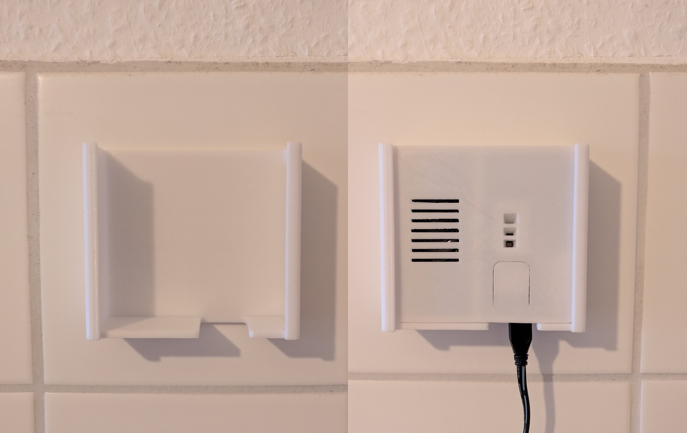
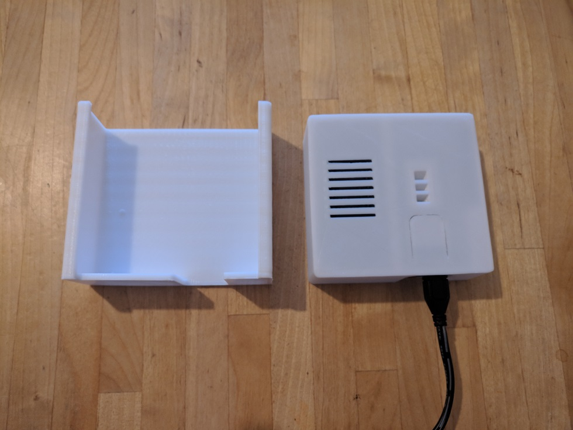

# Casemod by [@schneekluth](https://github.com/schneekluth)
When I printed the original files from Paul van Gaans the case would not fit at all. Paul and I have been in contact and it seems to be an issue of scaling. Therefore he gave me his Blender files and I made some corrections to it. Files should be ready to print.

### Advice
1. Keep in mind when printing the top of the case you have to tell your slicer to keep disconnected faces intact else your button will not work. In Cura this option can be found under: *Mesh Fixes > Keep disconnected faces*

2. Also I strongly suggest not to print the case with white filament as the LEDs are quite strong and colour seperation is harder when they shine through the filament.

### The new casing
I've changed as little as possible because Paul's design is already perfect. What I did:
* more space for the speaker and the pi
* new position of LED indicator
* bevel around the push button requiring less accuracy of the printer
* more space for the USB and SD-card 

### Wall Mount
I've also created two versions of a wall mount. It's just a simple case with a cutout in the bottom to leave room for cable and microphone. Version one is called **tape** because you have to tape it to a wall e.g. with double-sided adhesive tape or velcro tape. Version two is called **screw** because it has some mounting points attached to the side.

### Questions?
If you have questions feel free to ask me on [Birdsite](https://twitter.com/_HailEris/) or [Mastodon](https://chaos.social/@schneekluth).
